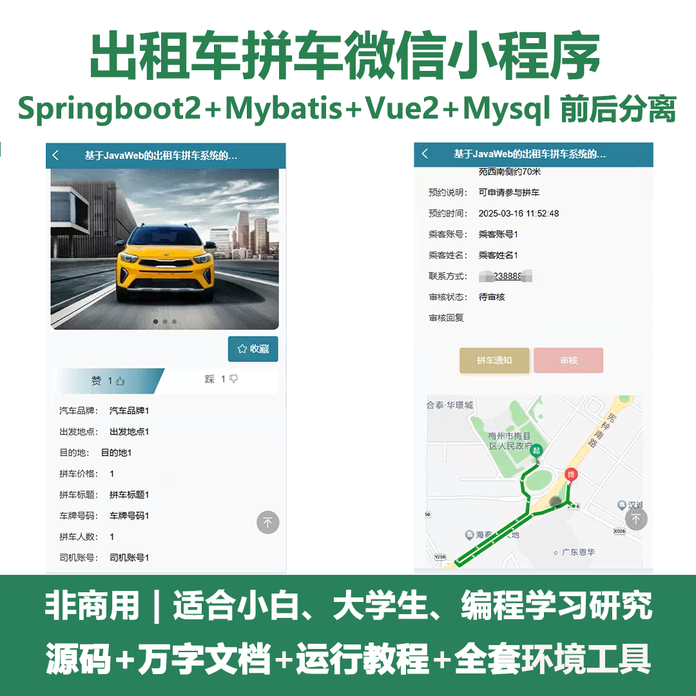
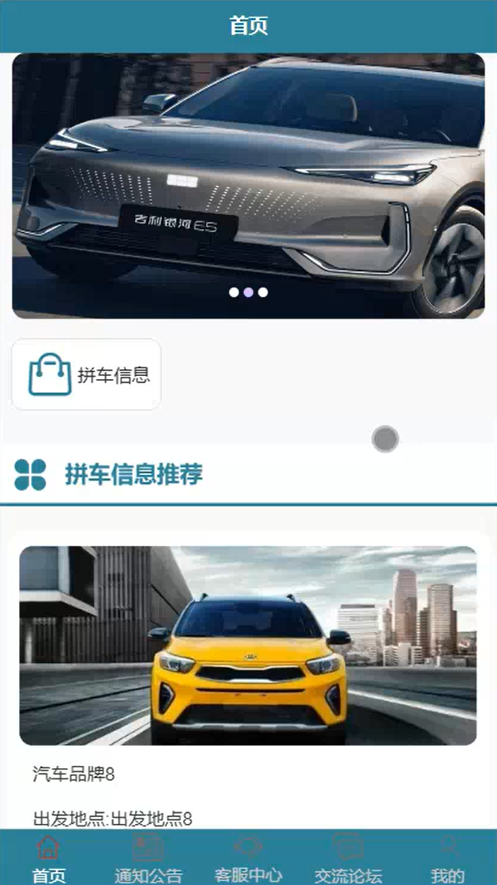
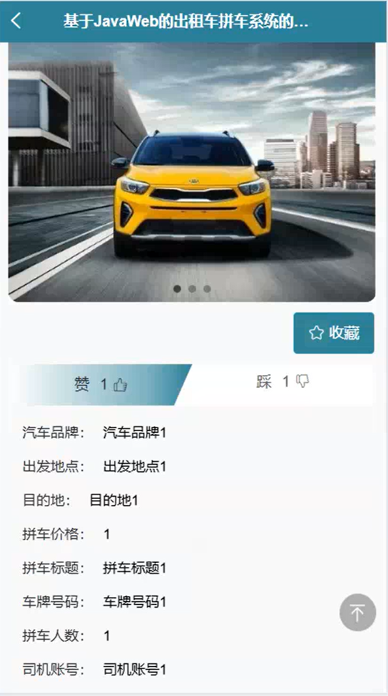
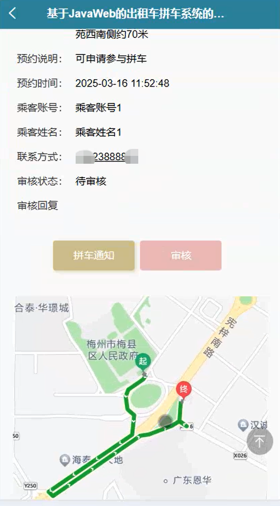
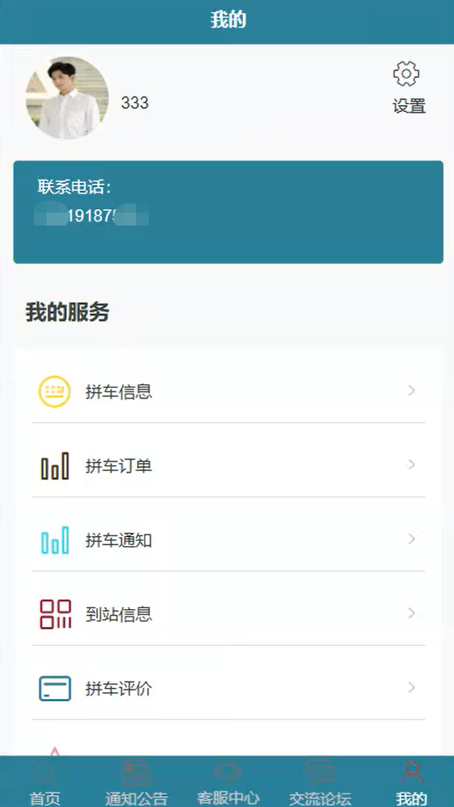
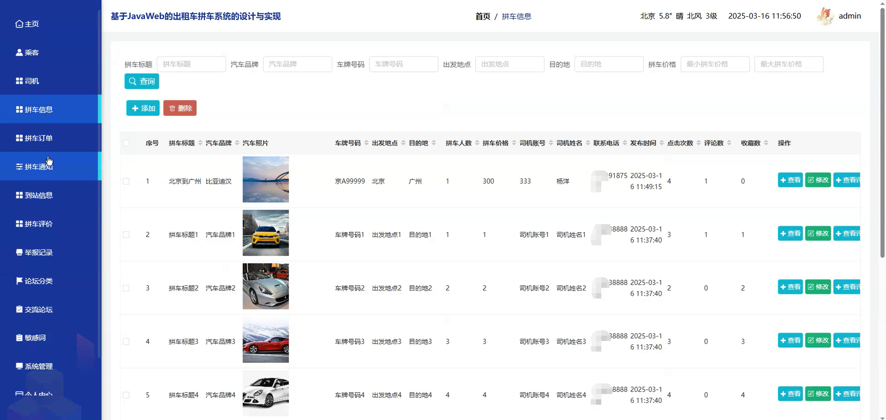
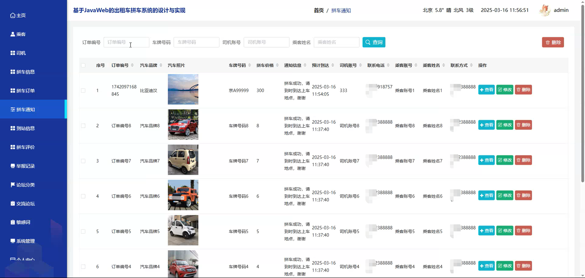
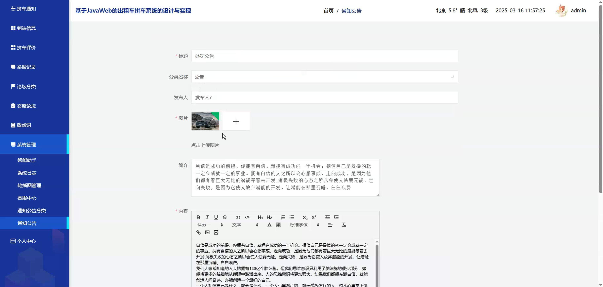
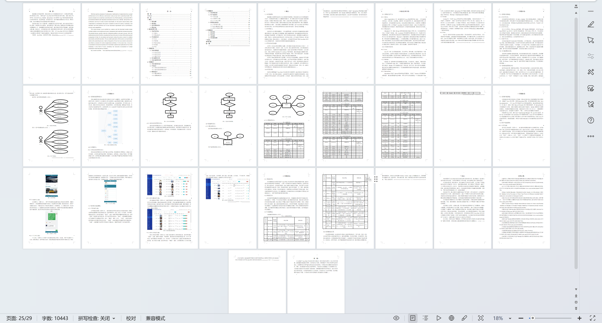

# mpweixinA201D
mpweixinA201D出租车拼车微信小程序+LW
 
## 源码问题查看主页咨询

### 一、关键词
拼车信息，拼车订单，拼车通知

### 二、作品包含
源码+数据库+万字设计文档+全套环境和工具资源+本地部署教程

### 三、项目技术
前端技术： Html、Css、Js、Vue2.0、Element-ui、uniapp
后端技术：Java、SpringBoot2.0、MyBatis

### 四、运行环境（以下版本亲测，其他版本兼容性请自行测试）
开发工具：IDEA/eclipse  + VSCODE + 微信开发者工具 + HBuilder X

数据库：MySQL5.7（最低要5.7版本）

数据库管理工具：Navicat10以上版本

环境配置软件： JDK1.8 + Maven3.6.3

前端Nodejs：14

浏览器：谷歌浏览器

### 五、项目介绍
项目编号：mpweixinA201D

出租车拼车微信小程序可以让用户方便快捷地发布和查找拼车信息，并进行订单管理、实时沟通等操作，从而达到节省出行成本、缓解交通压力和提高出行效率的目的。

角色：管理员、用户

管理员功能：主页、乘客、司机、拼车信息、拼车订单、拼车通知、到站信息、拼车评价、举报记录、论坛分类、交流论坛、敏感词、系统管理、个人中心。

用户功能：首页、通知公告、客服中心、交流论坛、我的、拼车信息、拼车订单、拼车通知、到站信息、拼车评价、我的收藏、客服中心、我的发帖、聊天记录、修改密码。

### 六、运行截图

